## 📊 Dataset Overview

The dataset includes:

- 🧮 Population growth rates (%)
- 🍼 Fertility rates (per woman)
- ⚰️ Mortality indicators
- 🌍 Country, Region, Subregion
- 🗓️ Time range: 2005–2022
- 🗺️ Surface area (sq. km)

---

## 📂 Data Model Overview

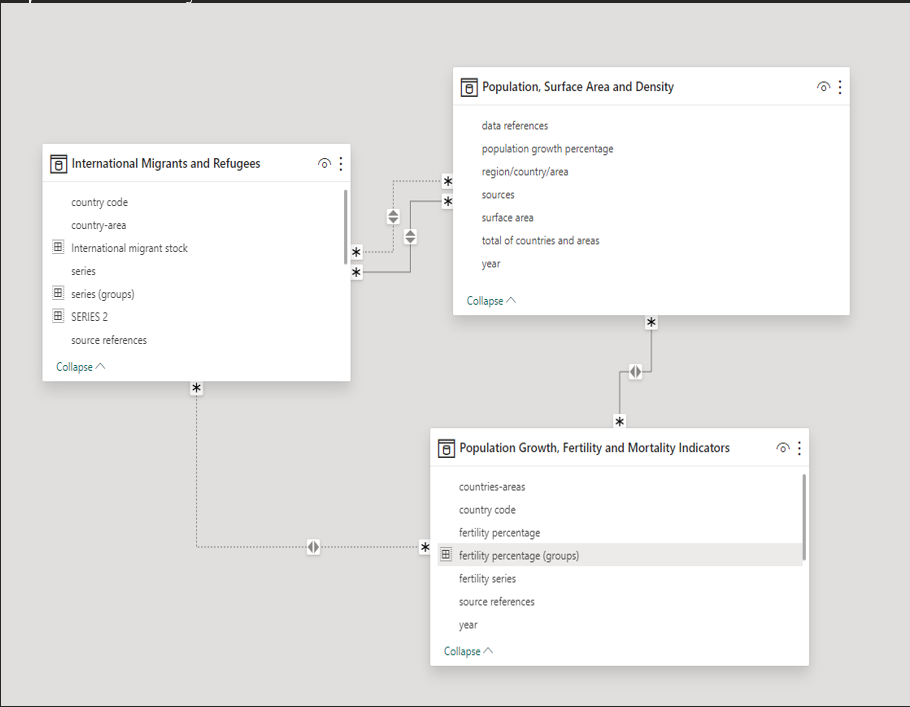  
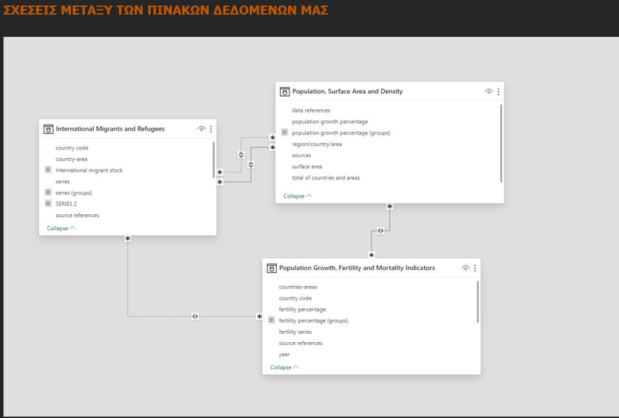

---

## ⏱️ Migration Insights

Migration trends visualized across time and geography:

- 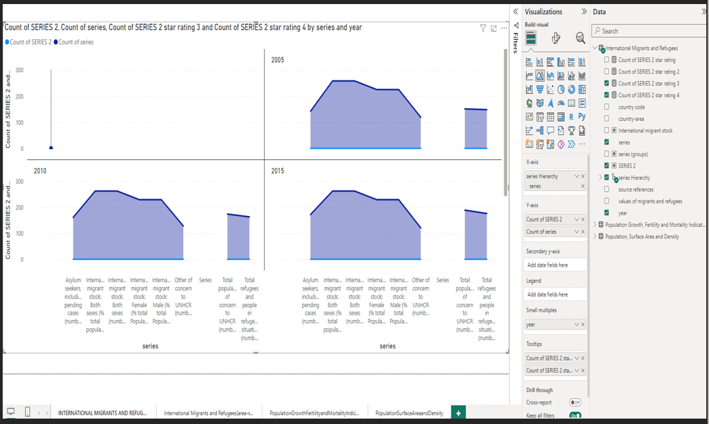
- 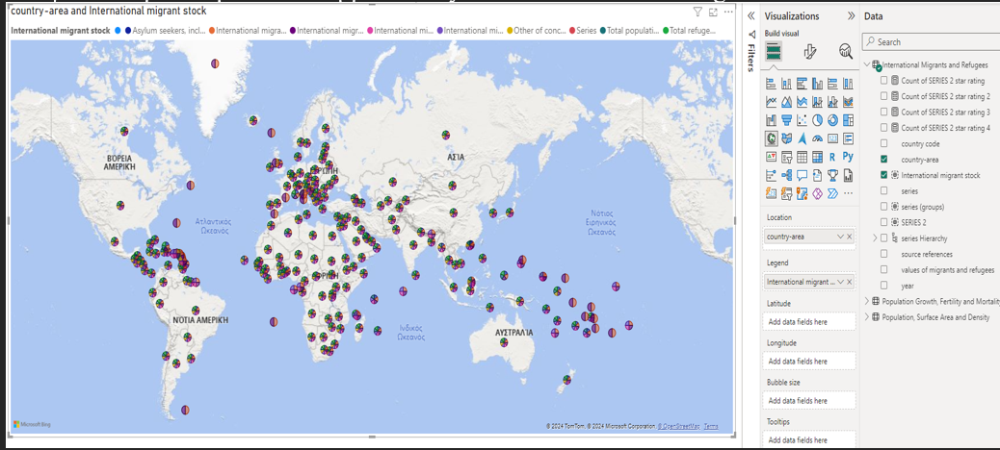
- 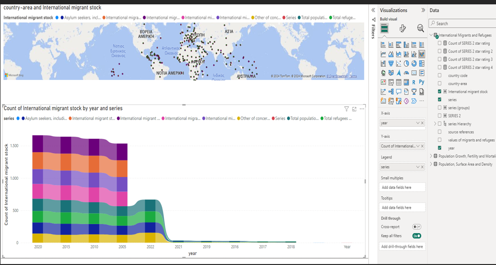
- 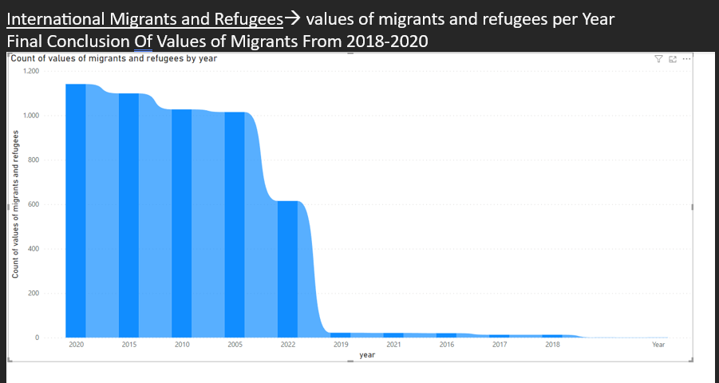

---

## 👶 Fertility Trends

- 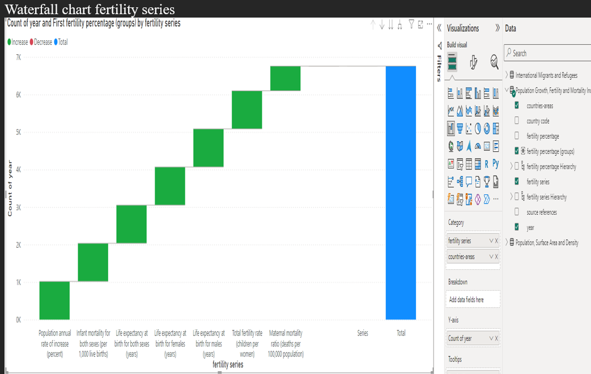
- 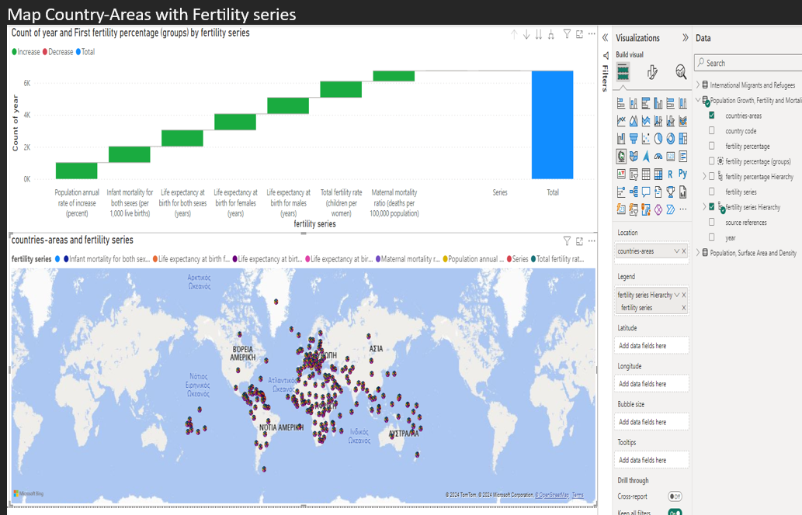
- 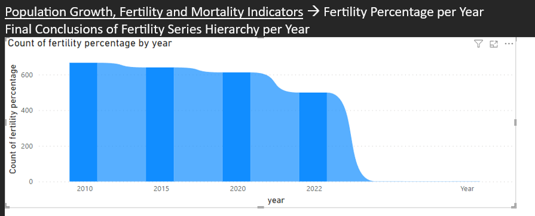

---

## 🌐 Population Growth

- 
- 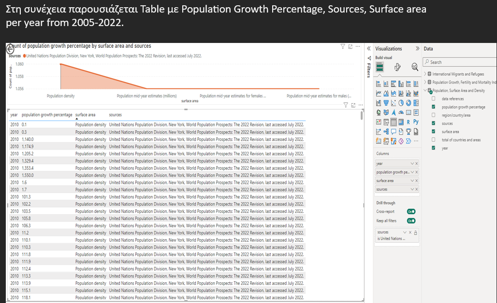
- 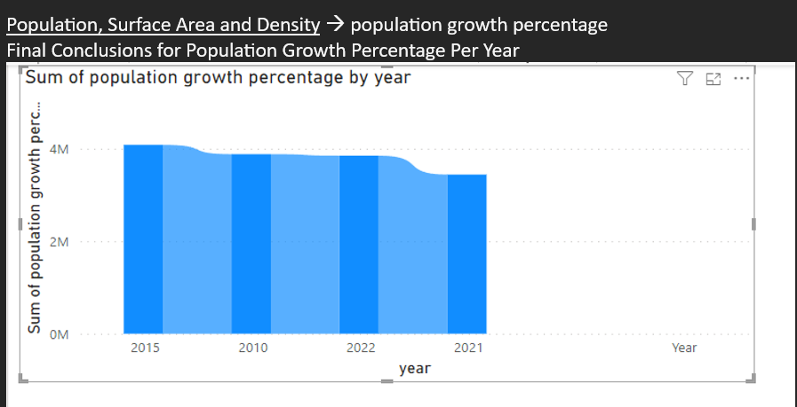
