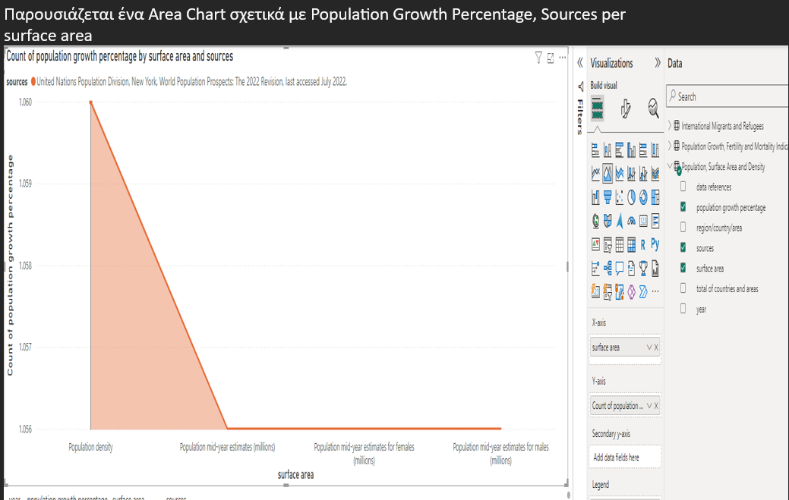

# population-growth-fertility-mortality-bi

Power BI analysis based on United Nations data for Population Growth, Fertility and Mortality. Includes comparative insights per country from 2005 to 2022, using area charts, waterfall charts, ribbon charts and geospatial maps.

## 📊 Dataset Overview

The dataset includes:

- 🧮 Population growth rates (%)
- 🍼 Fertility rates (per woman)
- ⚰️ Mortality indicators
- 🌍 Country, Region, Subregion
- 🗓️ Time range: 2005–2022
- 🗺️ Surface area (sq. km)

---

## 📂 Data Model Overview

  

---

## ⏱️ Migration Insights

Migration trends visualized across time and geography:

- 
- 
- 
- 

---

## 👶 Fertility Trends

- 
- 
- 

---

## 🌐 Population Growth

- 
- 
- 
